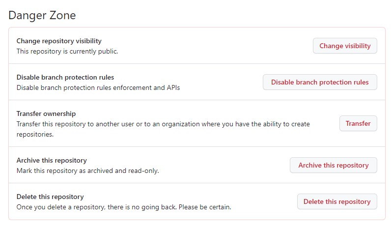
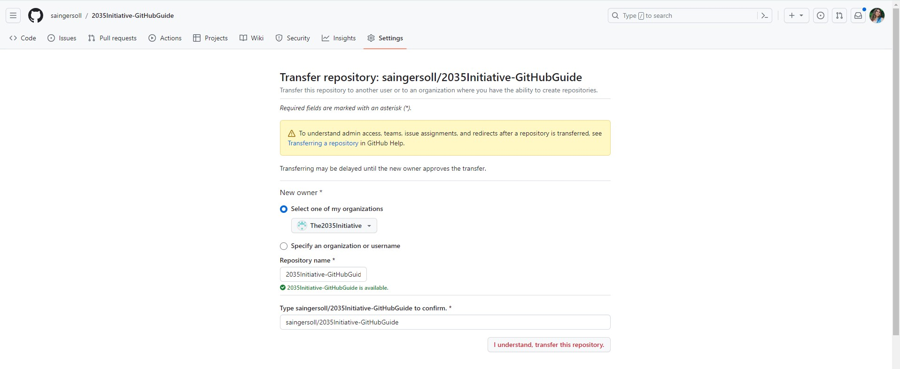

## Using the GitHub Organization

### Becoming a Member

To improve our workflow as a collective, all 2035 Initiative projects should be associated with our [GitHub Organization](https://github.com/The2035Initiative). If you are not a member yet, please send Sofia Ingersoll or Emma Franzblau an email to be added.

### Transferring Your Repository into Organization

We request that you kindly transfer any 2035 Initiative related GitHub projects into our Organization, to optimize our project management and communication. You can transfer any repository you've uploaded to the organization using the following steps:

1.  On GitHub.com, navigate to the main page of the repository.

2.  Under your repository name, click **Settings**. If you cannot see the "Settings" tab, select the dropdown menu, then click **Settings**.

```{r echo=FALSE}

```

3.  At the bottom of the page, in the "Danger Zone" section, click **Transfer**.

```{r echo=FALSE}


```

4.  Read the information about transferring a repository, then, under "New owner", select our organization from the drop down menu.

5.  Read the warnings about potential loss of features depending on the new owner's GitHub subscription.

6.  Following **Type REPOSITORY NAME to confirm**, type the name of the repository you'd like to transfer, then click **I understand, transfer this repository**.

If you published a GitHub Pages site in a private repository and added a custom domain, before transferring the repository, you may want to remove or update your DNS records to avoid the risk of a domain takeover. For more information, see "[Managing a custom domain for your GitHub Pages site](https://docs.github.com/en/pages/configuring-a-custom-domain-for-your-github-pages-site/managing-a-custom-domain-for-your-github-pages-site)."

## Adding Repository Collaborators

Oftentimes you'll find yourself collaborating with a person, or even a team of people on a project. To optimize the project's workflow, it would be most beneficial to add everyone to the project repository as collaborators.

\*\* Image of adding collaborators example \*\*

## Branches

To optimize collaboration and avoid the risk of merge conflicts, branches are the best tool in your box.

Using the Terminal to make a branch:

Using GitHub to make a branch:

\*\* When working with others on a project, always git pull before you start a new working session \*\*

## Merge Request
